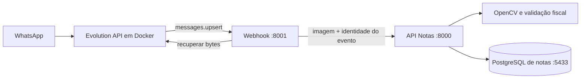

# Integração WhatsApp — Notas APAE

## Fluxo



- `webhook.py`: autentica a Evolution, filtra mensagens e coordena o envio.
- `evolution.py`: recupera a mídia em Base64 e entrega bytes, com limite de 10 MiB.
- `notas.py`: envia os bytes à API, com timeout e tratamento de erros.
- `teste_webhook.py`: mantém o comando antigo como entrada compatível.
- A leitura QR e a validação fiscal ficam exclusivamente na API de notas.

## Executar

Instalação, migration e inicialização dos dois processos estão em
[README da API](../api_notas_apae/README.md). A API precisa ser atualizada e receber
a migration antes de ativar o novo webhook. Nenhum `.env` real é editado pelo código.

Na raiz do projeto:

```powershell
venv/Scripts/python.exe -m pip install -r EvolutionAPI/requirements.txt
venv/Scripts/python.exe -m uvicorn EvolutionAPI.webhook:app --host 0.0.0.0 --port 8001 --env-file EvolutionAPI/.env
```

Mantenha a Evolution configurada com:

- URL `http://host.docker.internal:8001/webhook/whatsapp` no Docker Desktop.
- Evento `MESSAGES_UPSERT`, sem acrescentar o evento ao caminho da URL.
- Header `X-Webhook-Token` igual ao WEBHOOK_TOKEN do webhook.
- EVOLUTION_INSTANCE correspondente ao nome da instância (atualmente teste2).

O cliente interno usa NOTAS_API_URL e NOTAS_INTERNAL_API_KEY. Quando esta chave
não está definida, usa WEBHOOK_TOKEN. A API de notas precisa receber o mesmo
segredo. O inicializador `api_notas_apae/run_local.py` facilita isso no Windows,
lendo somente o token do arquivo existente. Para implantação em containers,
injete a chave interna no ambiente da API e use os nomes de serviço na rede.

## Respostas e repetição

A rota interna agora é POST /notas/processar-imagem, corpo binário. O webhook
transmite origem WHATSAPP, instância, ID da mensagem e telefone nos headers,
sem gravar esses dados em logs. Veja o contrato em
[REFATORACAO.md](../api_notas_apae/REFATORACAO.md).

- `saved=true`: API confirmou o registro das submissões.
- `replayed=true`: mesma origem, instância e ID; devolve os IDs anteriores.
- Nova mensagem com nota já conhecida: nova submissão DUPLICADA, mesma nota.
- `saved=false`: imagem processável, mas sem chave válida; resultado também é memorizado.
- HTTP 409: identidade do evento reutilizada com outro conteúdo/remetente.
- HTTP 413/415/422: imagem ou contrato inválido.
- HTTP 502/504: comunicação falhou; pode reenviar o mesmo evento sem duplicar a gravação.

Não há retry interno, fila de mensagens ou resposta automática ao doador.
O processamento ocorre durante a requisição. Eventos repetidos ainda recuperam
a mídia; precisam conseguir obter os mesmos bytes. A API evita repetir a leitura
QR e a gravação para um recibo já confirmado. Sem mídia disponível, a reentrega
retorna erro e requer intervenção/reenvio pelo remetente.

Mensagens próprias, grupos, broadcasts e remetentes sem telefone identificável
são ignorados. Um JID do tipo LID depende de remoteJidAlt com telefone.

## Testes

```powershell
venv/Scripts/python.exe -m unittest EvolutionAPI.test_integration -v
```

A suíte conjunta também testa perda da resposta depois do commit da API, seguida
de reentrega, sem Evolution real nem alterações no banco em uso.
